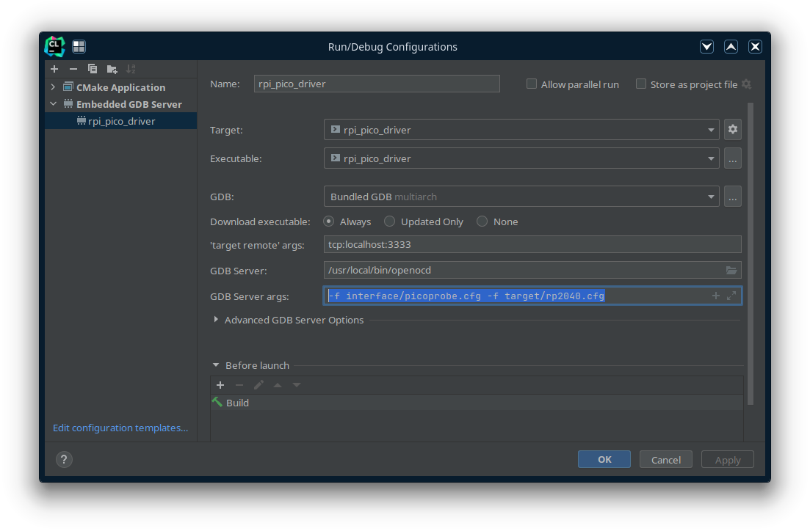

# LED-Cubes
A repo to hold my LED cube related projects.

## Raspberry Pi PICO Setup
Getting Started Guide: https://datasheets.raspberrypi.com/pico/getting-started-with-pico.pdf.

Requires the Pico C++ SDK. Instructions are provided in the Getting Started Guide.

Make sure the PICO_SDK_PATH environment variable is set. You may need to set the variable in your IDE.

I used the picoprobe to aid with development.
Refer to the `Appendix A: Using Picoprobe` section of the Getting Started Guide.

### CLion Setup
You will set the environment variables within the project. This is done by going to `File > Settings... > Build, Exexution, Deployment > CMake`. With a profile selected, add variables to the Environment field.

If using openocd and the picoprobe, create an `Embedded GDB Server` configuration and configure as shown below: 

### VSCode Setup
WIP (Need to get it working)
