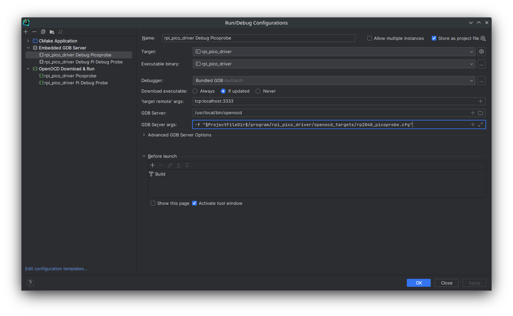

# LED-Cubes
A repo to hold my LED cube related projects.

## Raspberry Pi PICO Setup
Getting Started Guide: https://datasheets.raspberrypi.com/pico/getting-started-with-pico.pdf.

Requires the Pico C++ SDK. Instructions are provided in the Getting Started Guide.

Make sure the `PICO_SDK_PATH` environment variable is set. You may need to set the variable in your IDE as well.

If using the Picoprobe for development.
Refer to the `Appendix A: Using Picoprobe` section of the Getting Started Guide to set things up.

If using the Pi Debug Probe for development.
Refer to this webpage to set things up: https://www.raspberrypi.com/documentation/microcontrollers/debug-probe.html 

I use openocd and have created config files under [`program/rpi_pico_driver/openocd_targets`](program/rpi_pico_driver/openocd_targets) for using the Picoprobe and Pi Debug Probe.
These simply combined the needed config files that came with openocd for ease of use.

### CLion Setup
You will need set the environment variables used by CMake.
This is done by going to `File > Settings... > Build, Exexution, Deployment > CMake`.
With a profile selected, add variables to the Environment field.
The only one currently needed is the `PICO_SDK_PATH` variable that points to the location of the Pico SDK.

There are 2 ways to set up the Run/Debug configurations: `OpenOCD Download & Run` or `Embedded GDB Server`

#### OpenOCD Download & Run
This is the preferred way as it allows one to run or debug the program.

If using the Picoprobe, create an `OpenOCD Download & Run` configuration and configure as shown below: 
If using the Pi Debug Probe, create an `OpenOCD Download & Run` configuration and configure as shown below: 

#### Embedded GDB Server
This way only allows one to debug the program.

If using the Picoprobe, create an `Embedded GDB Server` configuration and configure as shown below: 
If using the Pi Debug Probe, create an `Embedded GDB Server` configuration and configure as shown below: 

### VSCode Setup
WIP (Need to get it working)
